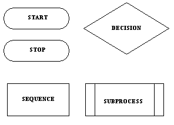
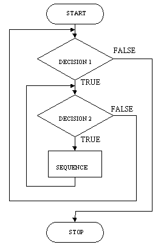

## For Loops, While Loops, Hash, Array

#### Key Terms
- DRY (Don't Repeat Yourself)
- Loops
- Conditionals
- Data Structures
- Array
- Hash
- Branches
- Expressions
- Values


## Data Structures

- Use "bedroom" analogy
- Talk about systems of organizing items in a room.

### Array

- Why use it?
	- Ordinal collections
	- When every element is of the same type (convenient)
	
- Why not use it?
	- When types change.
	- When ordinality is irrelevent
	- When searching by number takes too long
	
### Hash
- Why use it?
	- When you 
	
## Flow Control

## Program Design Symbols:



Draw a basic program.

### Interpreting of Code by the Computer
- How does the Ruby interpreter work?
	1. Read lines
	2. Look up "names" ("expressions") in "Dictionary" (i.e. Memory)
	3. return "definitions" (i.e. return their values)
	4. output results
- By default, this is a top to bottom, inner-most to outer-most movement.
- How do we change this?

### Flow Control

- Why use it?
	- **DRY coding**
	- Otherwise all programs would be just **linearly evaluated lists of code**.
	- To type 100 lines of output without copy-pasting a bunch of times perhaps, but...
	- What if you didn't know how many times you have to output a certain string?  How many times do you copy and paste code?

- "Linear Programming" otherwise

- Move "backwards"

####Conditionals

#### If
```
if (expression)
	do_thing_1
else
	do_default_thing
end
```
#### Elsif
```
if (expression1)
	do_thing_1
elsif (expression2)
	do_thing_2
elsif (expression3)
	do_thing_3
else
	do_default_thing
end

```

#### Case/When
```
x = 3
case x
when 1
	do_thing_1
when 2
	do_thing_2
when 3  
	do_thing_3
else  
	do_default_thing 
end
```

#### PRACTICE

Write a program called animal_noises.rb.  It asks the user to select an animal and then responds with the appropriate sound in the form of a string.
```
output: What animal would you like to hear?
input: cat
output: Meow!
output: What animal would you like to hear?
input: dog
output: Woof!

```

####Loops

#####For ... in
```
for i in (1..10)
	puts i
end
```
#####While

**WARNING: WHILE LOOPS MUST TERMINATE**

```
x = 0
while (x < 10)
	puts x
	x += 1
end
```

#### Nested Loops



```
for i in (1..10)
	puts "i: #{i}"	
	for j in (1..10)	
		puts "j: #{j}"		
	end
end
```

#### PRACTICE

Add an options menu to your animal_noises.rb program so that it keeps asking for an animal.

```
output: What animal would you like to hear?
input: cat
output: Meow!
output: What animal would you like to hear?
input: dog
output: Woof!
```

### A few basic programs:

- count to 100
- print a statement 10 times
- find a value in an array