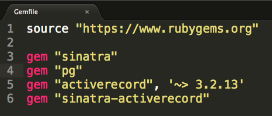

#ActiveRecord
###Models Revisited

- Encapsulates Factory Behavior
- Serves as an abstraction layer for interacting with the persistence layer.
- Usually defined as its own class with Factory-like behaviors.
- Usually singular and capitalized in name (i.e. Post)

#####Models (By Hand)

**models/post.rb**

```
class Post

	def self.create(attributes_as_values)
		# code
	end
	
	def self.all
		# code
	end
	
	def self.find(id)
		# code
	end
	
	def self.update(resource_id, new_attributes_as_values)
		# code
	end
	
	def self.destroy(id)
		# code
	end
	
end

```
####Models with ActiveRecord

- ActiveRecord allows you to simplify your models and allow them to inherit methods like these from a "Base" class.
- Your model definitions are now as simple as:


###ActiveRecord Setup in Sinatra

- Create Gemfile with:

```
source "https://www.rubygems.org"
 
gem "sinatra"
gem "pg"
gem "activerecord", '~> 3.2.13'
gem "sinatra-activerecord"

```


- Create a "Post" model inheriting from ActiveRecord::Base

```
class Post < ActiveRecord::Base

end

```


- Configure ActiveRecord::Base

```
# main.rb

ActiveRecord::Base.establish_connection(
    :adapter => 'postgresql',
    :host     => 'localhost',
    :username => 'your_login_name',
    :database => 'your_database_name',
    :encoding => 'utf8'
)

```


```if you forgot to set a primary key like I did, then:```

- Add PRIMARY KEY constraint using a migration file:

```
# db/migrations/001_add_primary_key_constraint.sql

ALTER TABLE posts
ADD PRIMARY KEY (id);

```

