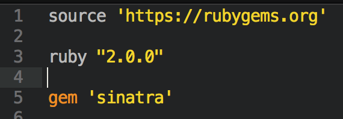
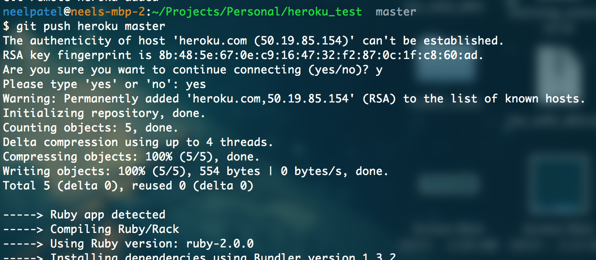

##Deploying a Sinatra Application On Heroku
---
### 1. Create a Heroku account
 - Go to Heroku's [website](www.heroku.com) and sign up for an account
 
### 2. Download and install Heroku Toolbelt
 - Download link can be found [here](https://toolbelt.heroku.com)
 - This will give you access to Heroku command line client 
 
### 3. Log in to Heroku via the command line
- Type **heroku login** in your terminal

         

### 4. Be sure the Ruby version is specified in the Gemfile
- Sample Gemfile
   
     

### 5. Create a config.ru file in your project's root directory 
- The controller file of your project needs to be required in the config.ru file.  In the below example, the controller file is main.rb. 

   

### 6. Initialize the project repo within Git
```
git init
git add -A
git commit -m "my first commit to heroku"
```
### 7. Create the app on Heroku
- Type **heroku create** in your terminal

   

### 8.  Set up credentials for external services 
- Setting access keys, secret tokens, etc as environment variables will allow you to keep this information out of your code
- The below example is setting up credentials for Amazon S3.  You can follow the same pattern, however you must replace the S3_KEY and S3_SECRET variables with your own information.  

```
heroku config:set S3_KEY=8N029N81 S3_SECRET=9s83109d3+583493190
```

- In your own application, you can recall these variables with the below pattern.

```
ENV['S3_KEY']
ENV['S3_SECRET']
```

### 9. Deploy your code 
- Type the command **git push heroku master** into your terminal

   

### 10. Ensure that a dyno is running
- Type the command **heroku ps** into your terminal

   

### 11. Congratulations, you're application is now on the internet!